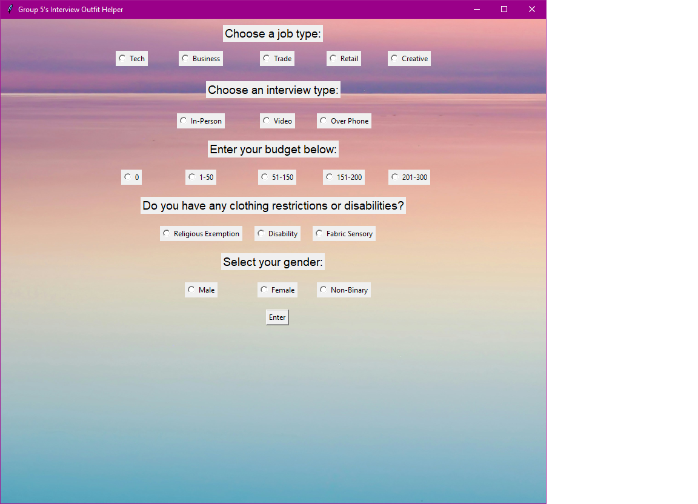
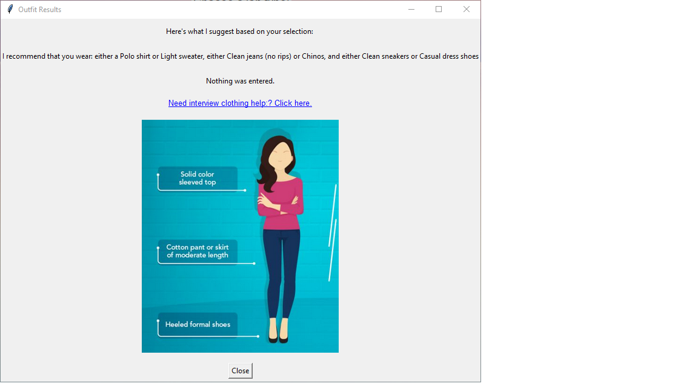

# Interview Outfit Helper
A Python Tkinter application that helps users choose appropriate interview attire based on job type, interview format, budget, and clothing accessibility needs.

# Project Overview
The Interview Outfit Helper is a program utilizing Python and Tkinter. 
The goal of this project is to help users make informed decisions about what to wear to a job interview based on several factors including job type, interview format (in-person, video, or phone), budget range, and potential clothing restrictions. 
The program provides clothing recommendations and alternative suggestions to accommodate religious needs, disabilities, or fabric sensitivities. 
Additionally, the application provides links to community clothing resources for individuals who may need assistance obtaining interview attire.

# Features

- Graphical User Interface (GUI) built with Tkinter
- Multiple user input selections (job type, interview type, budget, clothing restrictions)
- Conditional recommendation system using nested logic
- Accessibility considerations for disabilities, religious attire, and sensory sensitivities
- External resource links for organizations that provide interview clothing assistance
- Image examples showing appropriate interview attire based on selections
- Informational disclaimer popup

# Background Research, Information, and Key Terms

Appropriate interview attire can have a significant impact on a candidate’s first impression during the hiring process. Many job seekers may not know what clothing is appropriate for different industries or interview formats.  Also depending on your background 
this may be your first time being introduced to the idea of dressing for your interview.  Many job seekers lack the knowledge and resources to successfully present themselves for an interview. 
This project aims to provide general guidance while also acknowledging that financial limitations, disabilities, or religious requirements may affect clothing choices.

Key considerations addressed in this project include:

- **Professional appearance**: Dressing appropriately for the industry and interview setting.

- **Budget limitations**: Providing suggestions based on affordable clothing options.

- **Accessibility and inclusion**: Offering alternative clothing suggestions for individuals with disabilities, religious attire requirements, or fabric sensitivities.

- **Community support resources**: Directing users to organizations that provide interview clothing assistance.

The project promotes awareness of barriers some job seekers face and provides helpful guidance and resources.

# Project Dependencies

This project uses only Python’s standard library.

Required modules:

- `tkinter` – used to build the graphical user interface
- `webbrowser` – used to open clothing resource links
- `tkinter.messagebox` – used to display disclaimer information

No third-party libraries are required.

# Steps to run the program

Requirements:
- Python 3 installed

Steps:

1. Clone or download this repository.

2. Navigate to the project folder.

3. Run the program:

    python main.py

4. The Interview Outfit Helper GUI window will appear.

# Sample Use Cases
Example 1: 
    1. Job Type: Tech
    2. Interview Type: In Person
    3. Budget: $50-$150

The program suggests clothing options such as a polo shirt, chinos, and casual dress shoes.

Example 2:
    A user selects a fabric sensory restriction.
    The program provides recommended alternative fabrics such as:
        - Cotton
        - Bamboo
        - Modal
        - Lycra

Example 3:
    The user needs clothing assistance, the program provides links to organizations that help provide interview attire.  

# Interface Screenshots

Main program interface:

Example recommendation result:

 

# Table of Files

| File | Description | Contributors |
|-----|-------------|-------------|
| main.py | Main Python program containing GUI interface, recommendation logic, and image display system | Wyatt Beck, Tyler Boyajian |
| pseudocode.py | Initial planning and logical structure for the program | Wyatt Beck |
| README.md | Project documentation and instructions | Wyatt Beck, Tyler Boyajian | 
| assets/images | Background images used in the interface | Wyatt Beck |
| assets/Project_Pictures | Clothing reference images displayed based on user selections | Tyler Boyajian |
| assets/Screenshots | Images taken from the program to refrence in Readme.md | Tyler Boyajian |

# Citations
Background image: Photo by Harli Marten on Unsplash
https://unsplash.com/photos/photo-of-blue-and-pink-sea-n7a2OJDSZns

Images used in results: “Dress Code for Freshers in Interview and Office.” Naukri.com, 
26 May 2025, https://www.naukri.com/campus/career-guidance/dress-code-for-freshers-in-interview-and-office.

Community Clothing resources referenced: YWCA Olympia – Kathleen’s Closet
https://www.ywcaofolympia.org/kathleens-closet-1

Olympia Union Gospel Mission
https://ougm.org/our-programs/meals-services-and-more/

Adaptive Clothing Research:
Seymour, Emma. “The Best Adaptive Clothing Brands, According to People with Disabilities.” 
Good Housekeeping, 29 June 2023, 
https://www.goodhousekeeping.com/clothing/g35408937/adaptive-clothing/. 

Background Reserach for project:
"Community-Based Research About Homelessness Reveals Barriers for Homeless Young Adults." 
National Communication Association, 9 Sept. 2021, 
https://www.natcom.org/publications-library/community-based-research-about-homelessness-reveals-barriers-homeless-young/. 

Heine, Amy. “How To Dress for a Job Interview.” 
Indeed, 16 Dec. 2025, 
https://www.indeed.com/career-advice/interviewing/how-to-dress-for-a-job-interview. 

Coursera Staff. “What to Wear to an Interview.” 
Coursera, 
https://www.coursera.org/articles/what-to-wear-to-an-interview. 

_________________________________________________________________________________________________________________________________________________-
# Team WT - Update 2/23
Now that we have decided to do the interview dress program it should probably be laid out in the following ways:
1. Ask User for job type
2. Ask user for interview type
3. Ask user for budget

Based on answers:
 - Choose outfit catagory
 - Print Recommendation

We can add in GUI later but that seems to be the basic format in my head.  We can give the users options of jobs types such as Tech, Office, Retail, Trades, or Creative.  And then move on to interview types such as In Person, Video/Zoom, or Phone.  Lastely we would need to set budget levels like 0, Under 50, 50-100, and 150+.

# Team WT - Update 2/26
Talked about what roles each of us will work on. I (Tyler Boyajian) am going to working on our code, while Wyatt is doing graphical research to show our clothing suggestions to the user. These suggests should help the user find an affordable, yet reliable, outfit for interviews and/or work.

Side note - Also talked about whether or not to include a question about gender identity, but ultimately decided against it as we dont want to potentially offend anyone. Both of us felt like it was a good thought to include, just not for this type of project.

-**dressing to impress: interviews**, helping idividuals decide on interview wear, what would be best to wear for the job

# Team-WT - Update 3/4

I (Tyler) added the initial base code to our Githud group project, Wyatt added the psuedocode he was working on as well. Still working out kinks to make sure it works properly, but the main visual framework is up and works, to an extent. Working on applying 'if' statements so the results can be accurately shown.

Also talked about our group check-in comments, and are planning on updating those so we can resubmit them with the missing info.

# Team-WT - Update 3/5

Updated base code with complete suggestions, and connected clothing restrictions to their own suggestion which comes in the same window as the initial suggestion. Working on fully connecting the disibilities segment for more accurate suggestions. Also found a really nice website to use for fabric alternatives for people with sensory issues.

Fabric Alternative website - https://sensorysmart.co.uk/blogs/news/the-best-fabrics-for-sensory-sensitivity-and-what-to-avoid

Adding reference sites I've found so far. - Wyatt

Indeed.com "How to dress for an interview" - https://www.indeed.com/career-advice/interviewing/how-to-dress-for-a-job-interview

coursea.org "What to wear for an interview" - https://www.coursera.org/articles/what-to-wear-to-an-interview

Naukri.com "How to Dress for an Interview Formally" - https://www.naukri.com/campus/career-guidance/dress-code-for-freshers-in-interview-and-office

Goodhousekeeping.com "Adaptive Clothing" - https://www.goodhousekeeping.com/clothing/g35408937/adaptive-clothing/

OUGM.org "Clothing Bank hours of opperations and location" - https://ougm.org/our-programs/meals-services-and-more/

ymcaofolympia.org "Kathleens Closet" - https://www.ywcaofolympia.org/kathleens-closet-1

# Team-WT - Update 3/9

Wyatt suggested some changes to current code base, and Tyler rearranged the changes to fit them into the code. These changes were for adding a gender choice, as well as adding website links to give further advice based on gender. Also added a messagebox pop-up with the premise the app works as a guide and is for informative purposes only.
